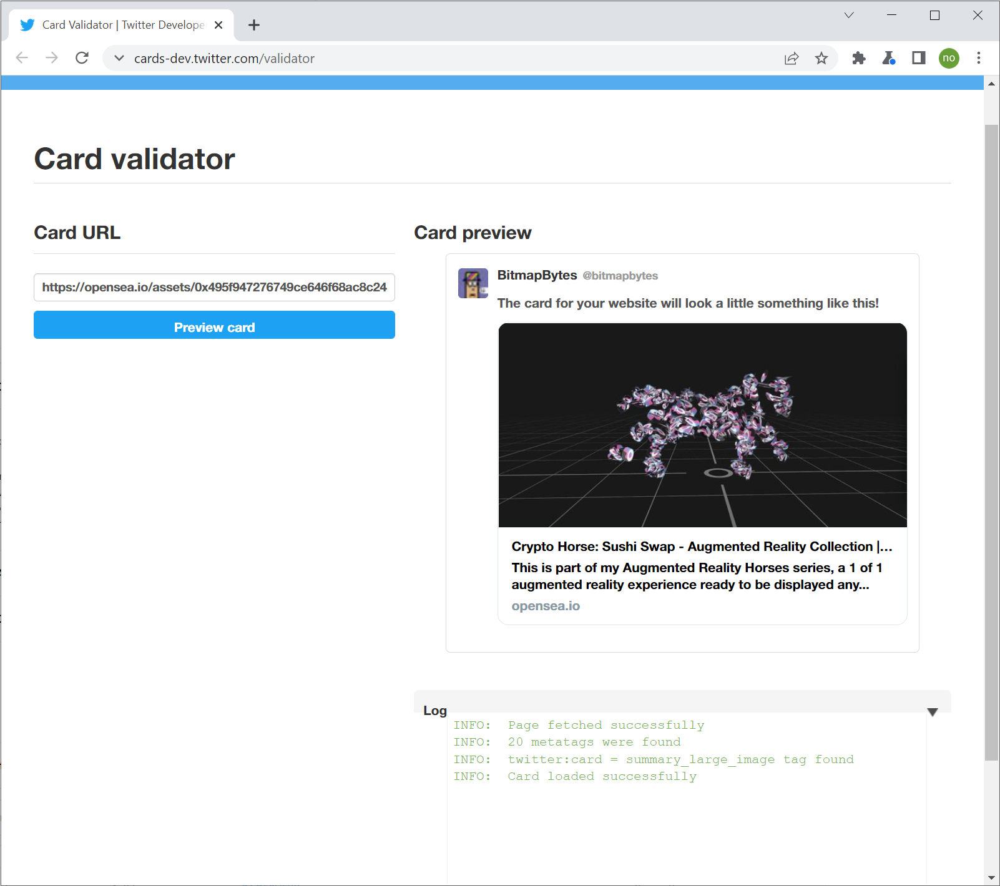

# Twitter-Card-NFT-Generator
Designed as concept to enhance OpenSea Social share capabilities enabling users on the twitter platform to interact with shared 3D NFT content whilst providing additional analytic tracking of interaction through the custom player.

# Demo
Demo and more info can be found here - 
https://nfthack2022.netlify.app/social

# Example Player source
Can be found in /player folder.

# Twitter social code example
Here we point to our player and pass in additional params to generate the 3D asset within the player.
1. src - location of the glb asset to load in.
2. poster - the static image to display whilst waiting for the GLB to load in and display.
3. alt - overview on the model.

&lt;meta name="twitter:card" content="player"&gt; 
&lt;meta name="twitter:player" content="https://nfthack2022.netlify.app/player/3DViewer.html?src={opensea3DAsset}&poster={openseaPoster}&alt={openseaAlt}"&gt; 
&lt;meta name="twitter:player:width" content="480"&gt; 
&lt;meta name="twitter:player:height" content="480"&gt; 
&lt;meta name="twitter:image" &gt; 

## Example of OpenSea Static Card

## Example of OpenSea with Custom 3D Player

